1ère partie **2ème partie** 3ème partie 4ème partie 5ème partie
Production **Utilisation** Production Memento vers d'autres
de la vapeur **de la vapeur** de glace technologique horizons
▲

**2ème Partie** Liste des chapitres:

### ► Chap I – La plaque chauffante à vapeur

```
Chap II – Le caisson isolant
Chap III – La stérilisation médicale http://www.soleil-vapeur.org
Chap IV – La cuisson alimentaire à l'eau et à la vapeur
Chap V – Performances et autres concepts
Chap VI– Autres cuissons agro-alimentaires
Chap VII – Agro-carburants, huiles essentielles....
Chap VIII – Autres modes d'utilisation de la vapeur
```
# Chapitre I LA PLAQUE CHAUFFANTE A VAPEUR

Pages
* 2 Section I -PRESENTATION DE LA PLAQUE CHAUFFANTE A VAPEUR
* 4 Section II – ETUDE D LA PLAQUE CHAUFFANTE A VAPEUR
* 4 § 1) Approvisionnement, débit et marquage des plaques
* 5 § 2) Usinage au tour
* 6 § 3) Percements et taraudages des plaques
* 10 § 4) La gravure du circuit de vapeur
* 13 § 5) L'assemblage
* 13 § 6 Les entrées et sorties de vapeur
* 13 § 7 Le choix du joint torique
* 15 § 8 Perfectionnements envisageables
* 15 § 9 Cotes pour une plaque Ø 216 mm
* 20 Section III FABRICATION DE LA PLAQUE CHAUFFANTE A VAPEUR
* 20 § 1 Approvisionnement, débit et marquage des plaques
* 21 § 2 Usinage sur tour
* 22 § 3 Percements et taraudages
* 25 § 4 La gravure du circuit de vapeur
* 27 § 5 L'assemblage
* 28 Section IV UTILISATION ET PERFORMANCES DE LA PLAQUE A VAPEUR
* 28 § 1 Utilisation
* 28 § 2 Performances
* 30 SECTION V UNE PLAQUE LOW COST

**2ème Partie** Utilisation de la vapeur **Chap. I** La plaque chauffante à vapeur

[TOC]

## SECTION I -PRESENTATION DE LA PLAQUE CHAUFFANTE À VAPEUR

Il existe de multiples:méthodes d'utilisation de la vapeur : serpentin échangeur immergé, récipient à double fond, serpentin extérieur au récipient, etc...Dans le cadre des travaux sur le capteur, un procédé original a été conçu et mis au point à l'Université Rice de Houston: la plaque chauffante à vapeur. Le principe est de faire circuler de la vapeur dans une plaque en aluminium, et d'utiliser cette plaque comme on utiliserait une plaque de cuisson électrique.
Le procédé s'est avéré satisfaisant au point de supplanter tous les autres, tant pour des raisons techniques que pour des raisons d'ergonomie : l'utilisateur installe et enlève le récipient de cuisson sans avoir à s'occuper des raccordements de vapeur.

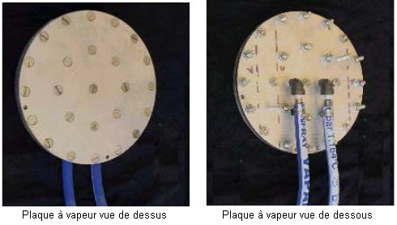

La plaque est composée de deux demi plaques superposées en aluminium, dont l'une comporte une engravure dans laquelle circule la vapeur. La vapeur fournie par le capteur entre dans l'engravure, cède son énergie thermique (que la plaque cède à son tour au récipient), et se condense. La sortie des condensats est contrôlée par le système de régulation (un robinet manuel, et un robinet automatique) afin de maintenir la vapeur à la pression et donc la température souhaitées.

La plaque est disposée à l'intérieur d'un caisson isolant. Une cuillerée d'huile (alimentaire) est répandue sur la plaque, pour favoriser le transfert thermique entre la plaque et le récipient. Une différence de température de l'ordre de 20° C entre la vapeur circulant dans la plaque et le contenu du récipient est suffisante : ce faible Δ t fut parmi les plus heureuses surprises lors des travaux de soleil-vapeur.org

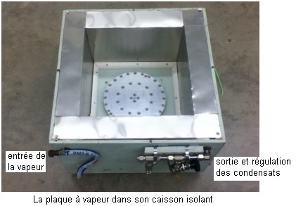

## SECTION II - ETUDE DE LA PLAQUE CHAUFFANTE À VAPEUR

Une plaque à vapeur est composée de deux plaques en aluminium assemblées par des boulons. La plaque supérieure comporte une engravure dans laquelle circule la vapeur. L'étancheité en périphérie est assurée par un joint torique. On envisage de confectionner une plaque diam 240 mm.

* Epaisseur de la tôle d'alu : 9,52 mm, ou 10 mm.
* Section de l'engravue : 5mm x 3 mm de profondeur.
* Angle entre les rayons de l'engravure : 30°

### II.1 APPROVISIONNEMENT, DEBIT ET MARQUAGE DES PLAQUES

Afin d'éviter l'achat d'une grande tôle alu chez un négociant en métaux, il est préférable de s'adresser à un atelier de tôlerie ou de carrosserie de véhicule utilitaire qui débitera une tôle à la cisaille. Veiller alors à ce que le cisaillage ne déforme pas la tôle en rives, car il est nécessaire de disposer d'une tôle bien plane (le cas échéant, faire débiter une tôle plus grande que besoin, et éliminer ultérieurement.la partie non plane.
Autre solution d'approvisionnement aux USA : Mcmaster.com # 9246K54 tôle dimension 12" x 36" soit 304,8mm x 914,4mm, dans laquelle on peut découper deux plaques Ø 240 mm et deux plaques Ø 216 mm

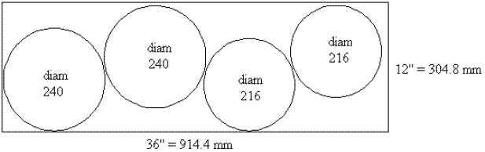

* Tracer les plaques en repérant les centres
* Découper les plaques à la scie sauteuse, en utilisant une lame à denture moyenne (une lame à
  denture fine s'engorge rapidement dans de l'alu). Adoucir à la grosse lime les éventuelles aspérités
  sur le pourtour, afin de faciliter la finition sur tour.
* Marquer les centres au foret à centrer sans traverser la plaque. Utiliser un foret dont l'angle est
  compatible avec la pointe de la poupée mobile du tour (voir ci dessous).

**Repérer les plaques :** les plaques brutes ne sont généralement pas parfaitement planes. Il convient soit de les dresser (sur tour? Sur fraiseuse? À l'aide d'une presse?), soit de repérer soigneusement les déformations de façon à les contrarier et les annuler, cette dernière solution étant la plus simple. Noter que la profondeur de la gorge du joint torique devra être régulière, ce qui suppose une plaque plane.
Assembler les plaques pour le mieux, puis **marquer les plaques,** par exemple :
"Plaque supérieure- face de dessus" et "plaque supérieure- face de joint"
"Plaque inférieure – face de joint" et "Plaque inférieure- face de dessous"
Repérer aussi les plaques sur chant, pour bien les orienter, et reporter ces repères sur le plat, car les repères sur chant vont disparaître à la prochaine étape.

### II.2 USINAGE SUR TOUR

**A) REPRISE DES CHANTS**

Il faut disposer d'un tour avec une hauteur sur banc de 125 mm. La plaque d'alu n'est pas prise dans les mors du mandrin, mais plaquée contre le mandrin dont on ouvre largement les mors, et maintenue par la contrepointe de la poupée mobile, que l'on engage dans le percement de centrage effectué à l'étape précédente. Régler préalablement le tour sur une vitesse très lente, et vérifier périodiquement le serrage de la poupée mobile.

**B) USINAGE DE LA GORGE DU JOINT TORIQUE**

usiner la gorge du joint torique sur la plaque supérieure - face de joint. Vérifier sur le tour
que la plaque n'est pas voilée, afin d'avoir une profondeur de gorge régulière.

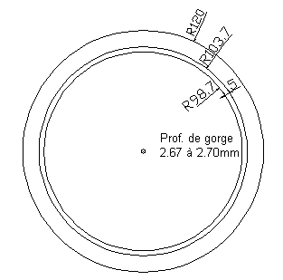

Sur le mode de calcul de la gorge, voir § 7

### II.3 PERCEMENTS ET TARAUDAGE DES PLAQUES

**A) PERCEMENTS POUR L'ASSEMBLAGE**

Les plaques sont assemblées par des vis inox M6 à tête fraisée.
Les têtes de vis sont apparentes sur la plaque supérieure – face de dessus
Pour des questions d'étancheité, les vis sont vissées dans la plaque inférieure, puis, pour des questions de résistance, elles reçoivent un écrou. Effectuer les perçages au Ø 6,1 mm pour le passage des vis dans la plaque supérieure, et au Ø 5 mm pour les taraudages.

**B) PERCEMENTS POUR TARAUDAGE DES RACCORDEMENTS DE VAPEUR**
Ces deux percements sont à effectuer uniquement sur la plaque inférieure.

**C) PERCEMENTS POUR PRE-ASSEMBLAGE DES PLAQUES**
Il est très utile de disposer de quelques percements et taraudages supplémentaires en périphérie, disposés non symétriquement, pour éviter les erreurs et inversions en tous genres lors des travaux. Les percements sont à effectuer sur une fraiseuse à affichage numérique. Les plans ci dessous fournissent les cotes des percements par rapport au centre de la plaque.
Pour effectuer les percements, installer les deux plaques inférieure et supérieure sur la fraiseuse
selon leur assemblage définitif ultérieur, mais en retournant l'ensemble La plaque inférieure – face de dessous est donc en vue de l'opérateur, ce qui permet de percer les entrée et sortie de vapeur.

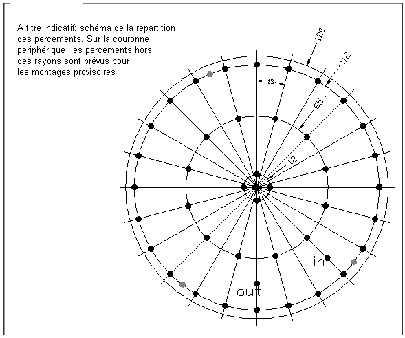

Dans un premier temps, effectuer **tous** les percements au Ø 5 mm **jusqu'à mi épaisseur** environ de la plaque supérieure, y compris les entrée-sortie de vapeur, afin de les repérer ultérieurement. Pour des questions de lisibilité, les cotes des percements sont fournies sur deux feuilles de plans différentes, mais tous ces percements Ø 5 mm s'effectuent sans avoir à dépointer les plaques de la fraiseuse.

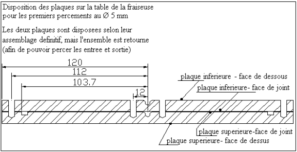

Avec un peu de malchance, il peut être nécessaire de percer de part en part la plaque inférieure en son centre, afin de le repérer sur la fraiseuse. Ce n'est pas bien grave, il sera toujours possible plus tard de tarauder le percement et de le boucher avec une vis à tête fraisée.

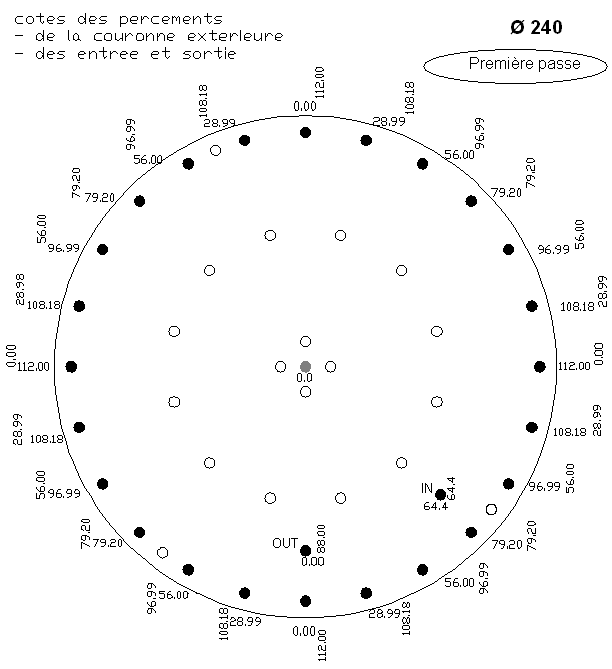

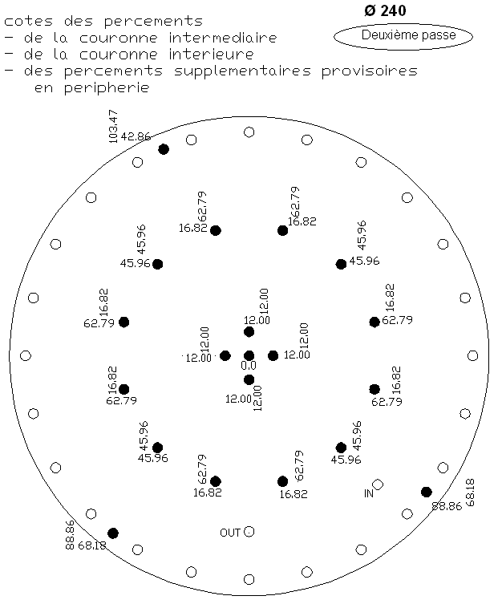

On peut ensuite reprendre chaque plaque :
**Plaque inférieure** : 

* tarauder les percements d'assemblage et de préassemblage


- repercer et tarauder les entrées-sortie de vapeur à 1/8"
**Plaque supérieure** : - reprendre tous les percements au foret Ø 6,1mm
- effectuer les fraisages pour les têtes de vis. Contrôler la conformité de l'angle de la fraise avec l'angle des têtes de vis (normalisé à 90° pour les vis à pas métrique, et veiller à ce que aucune tête de vis ne dépasse, le transfert thermique ne le supporterait pas un espace entre la plaque et le récipient (ce n'est pas bien grave si la tête est légèrement en retrait). Pour la même raison, il peut être nécessaire d'ébavurer les fraisages avec une toile abrasive.

### II.4 LA GRAVURE DU CIRCUIT DE VAPEUR

Le circuit de vapeur est gravé sur la plaque supérieure- face de joint, c'est à dire sur la même gorge que le joint torique.
**Section du circuit** : largeur 5 mm, profondeur 3 mm
**Une fraise "end mill"** double flute Ø 5 mm convient, par exemple Mcmaster 8555A62.
**Installer la plaque** sur la table de la fraiseuse, insérer deux vis M6 dans les percements "extrême gauche" et "extrême droite". Caler les deux vis contre la rainure centrale de la table de la fraiseuse, et fixer la plaque sur la table. Insérer une pointe à centrer dans le mandrin de la fraiseuse, centrer la table par rapport au centre de la plaque, et mettre l'affichage digital à Zéro en X et en Y

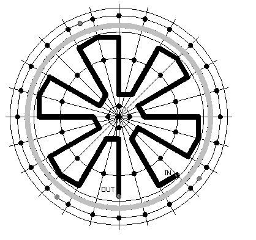

**Effectuer la première passe** : Graver les deux rayons parallèles à la table, et les deux
perpendiculaires

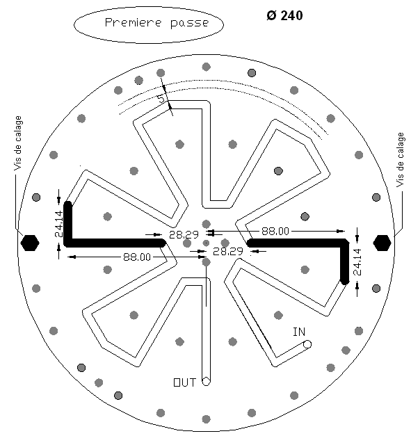

**Déposer/reposer la plaque** sur la table de la fraiseuse en la calant comme précédemment après
une rotation de 30°.
**Effectuer la seconde passe**.
**Noter** que la seconde passe et la première passe ne sont pas exactement identiques, voir notamment la cote 28,29 mm sur la première, et la cote 24,5 sur la seconde. Toutefois il n'y a pas d'inconvénient majeur si une engravure se prolonge quelque peu au delà du tracé prévu, sauf à l'approche du joint torique.

NB L'entrée de vapeur n'est pas positionnée comme sur les photos


### II.5 L'ASSEMBLAGE

**Utiliser des vis à tête plate fraisée** M6 L = 25mm en acier inoxydable, sans rondelle (à cause de l'étancheite). En l'attente d'une note de calcul concernant les vis, veiller à utiliser des vis dont la résistance est connue et certifiée, par exemple Mcmaster.com # 92125A242 "minimum tensile strenght of 100 000psi", ou équivalent métrique. Ce sont souvent des vis à empreinte hexagonale ou cruciforme. Les vis à empreinte ordinaire "tête fendue" ne conviennent généralement pas, leur résistance n'est pas précisée, et de plus on peut remarquer une bavure sur la tête de la vis, résultant de l'usinage de l'empreinte.
**Utiliser un produit d'étancheité** du type "frein filet" résistant à la température (Loctite 272 ?). Garnir le filet, mais aussi la tête de vis, ainsi que l'écrou.
**Serrage dynamométrique** il est hautement souhaitable d'effectuer un serrage à la clé dynamométrique. Le cas échéant, on peut se procurer une clé dynamométrique chez les revendeurs de cycles, elles sont utilisées par les amateurs pour le serrage contrôlé des pièces en carbone de leur bicyclette.
Couple de serrage : la longueur du taraudage dans la plaque inférieure est de 9,5 ou 10 mm, c'est à dire le double de la longueur du taraudage d'un écrou M6 normalisé (5 mm). En prenant pour référence la boulonnerie acier de classe moyenne lubrifiée (le produit d'étancheité ayant un rôle de lubrifiant), un couple de 8 à 9 Nm = 5,9 à 6,6 lbfxft = 70 à 80 lbf.xIn semble adapté aux circonstances. Pour le serrage de l'écrou, on conserve la même valeur.

### II.6 LES ENTREE ET SORTIE DE VAPEUR

Utiliser deux raccords coudes au quart male-femelle 1/8" en acier, en fonte malléable, ou en Inox.
Braser à l'argent 40% un raccord laiton sur le filetage femelle, et y raccorder ensuite un tuyau vapeur Ø 6 mm. Faire un essai préalable de vissage du raccord sur la plaque, et vérifier qu'il ne dépasse pas à l'intérieur de la plaque vapeur. Si le raccord n'est pas bien orienté après vissage, on peut essayer de reprendre son filetage à la filière 1/8". Garnir le filetage de frein filet ou de Teflon. Prendre garde au fait que les vis d'assemblage peuvent gêner le vissage du raccord sur la plaque. Il est peut-être judicieux de visser le raccord avant de refermer la plaque

### II.7 LE CHOIX DU JOINT TORIQUE

Voici, à toutes fins utiles, comment a été effectué le choix du joint torique.

**Documentation** On peut utiliser, entre autres, trois sources de documentation

- le Joint Français, [http://www.oring.fr/LJF_Catalogue_Torique.pdf](http://www.oring.fr/LJF_Catalogue_Torique.pdf)
- Eriks [http://www.eriksusa.com/en/products/o-rings/](http://www.eriksusa.com/en/products/o-rings/) et O-rings .info
- Parker [http://www.parker.com](http://www.parker.com) Le catalogue O ring de chez Parker a le très grand avantage de
    fournir les dimensions en pouces (colonne 5), en millimètres (colonne 7), et en Uniform
    Dash Number (colonne2), qui est une référence commune pour tous les fabricants et
    revendeurs de joints toriques. La Nominal Size (colonne 2) est une dénomination obsolète
    dont il ne faut pas tenir compte. Pour notre usage, on peut se reporter à la page 230 du
    catalogue.

**Fournisseurs** entre autres :

- solutions-élastomères.com (= Total = Hutchinson = Le joint français)
- Mcmaster.com

**Choix du matériau**

* chez Le Joint Français ce matériau est dénommé FPM (et EP 851?), cf pages 5 et 7 du
  catalogue.

* chez Eriks ce matériau est dénommé Viton, cf pages 13 et 86 du catalogue.

- Chez Parker ce matériau est dénommé FKM

**Diamètre de tore**
On choisit ici une Cross Section Diameter = CSD = d2 (chez LJF) = 3,53 mm. Voir Eriks page 31.
**Type de montage**
C'est un montage statique axial avec pression venant de l'intérieur. Selon Le Joint Français page 27
"si la pression agit de l'intérieur vers l'extérieur, le joint torique présentera un diamètre extérieur
légèrement supérieur de 1 à 2% à la cote H sur laquelle il prendra appui, H étant le diamètre
extérieur de la gorge du joint torique", ce qui est corroboré par Eriks page 132 / axial seal "When
system pressure is from the outside, the groove inside diameter is of primary importance and the
groove width then determines the outside diameter. When system pressure is from the inside, the
reverse is true..."
**Dimension du joint et diam extérieur de la gorge**
Soit un joint diamètre intérieur 202,80 mm, diam extérieur 209,86 mm.
En réduisant le diamètre de 1,2% environ, on obtient une cote H de 207,4mm, soit 103,7 mm de
rayon, pour l'extérieur de la gorge
**Choix final et références**
On retient ce joint torique : diam intérieur 202,80 mm, diam de tore 3,53 mm, Uniform Dash
Number 266, en Viton FKM. Par exemple : Mcmaster 9464K565.
**Profondeur de gorge**

* selon Le Joint Fançais page 26 : profondeur 2,70 mm pour un écrasement de 23%

* selon Eriks page 139 : profondeur 2,67 mm pour un écrasement de 24,36%.
  La profondeur de gorge doit être assez précise, pour obtenir une bonne compression du joint,
  garante de l'étancheité. C'est pourquoi il faut veiller, dès le début des opérations, à la planéité de la plaque sans laquelle l'usinage précis n'est gère possible.

**Largeur et diamètre intérieur de la gorge**

* selon le Joint Français page 26: largeur 5 mm

* selon Eriks page 139 : 4,05 à 4,60 mm

En fait dans notre cas la largeur de la gorge n'est pas très importante, tant que le joint y trouve le volume suffisant après compression. On retient ici une gorge de 5 mm de large, donc un diamètre intérieur de 197,4 mm, soit 98,7 mm de rayon.

### II.8 PERFECTIONNEMENTS ENVISAGEABLES

Telle quelle la plaque chauffante à vapeur donne satisfaction, mais il reste encore à
approfondir plusieurs aspects

- étude de résistance des matériaux : quelle épaisseur pour la plaque supérieure? Quelle
    épaisseur pour la plaque inférieure, sachant qu'il faut pouvoir tarauder pour le entée-sortie
    de vapeur?
- Nombre et répartition des boulons?
- Longueur de l'engravure pour la vapeur? Pour faciliter son usinage,il est souhaitable, il est
    souhaitable que l'angle entre les "rayons" de l'engravure soit de 15, 18, 22,5, ou 30°. Quel
    est le minimum (30 ° comme ci dessus?), quel est l'optimum?

### II.9 COTES POUR UNE PLAQUE Ø 216 mm

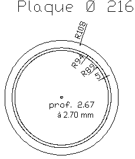

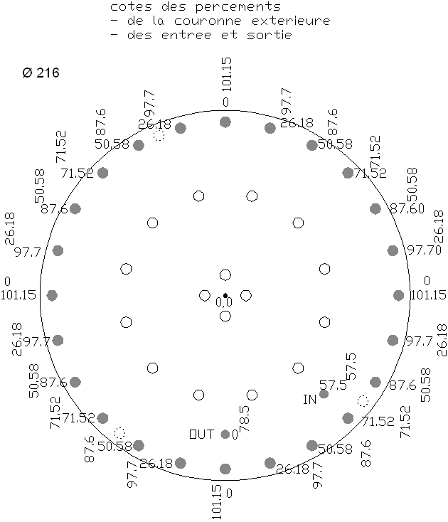

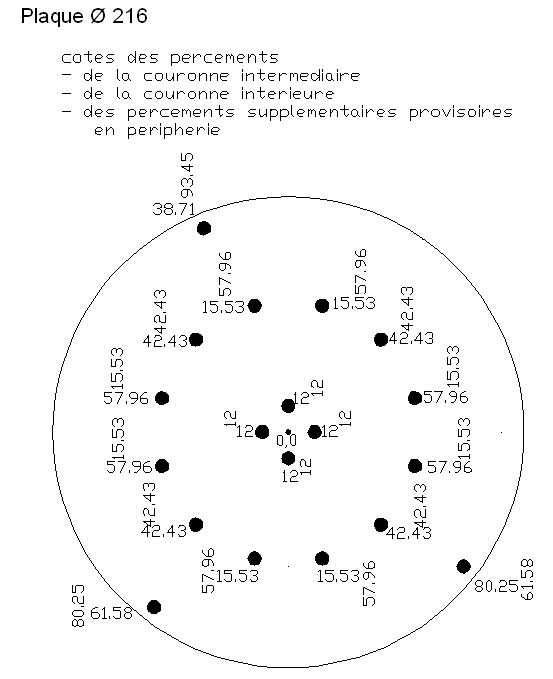

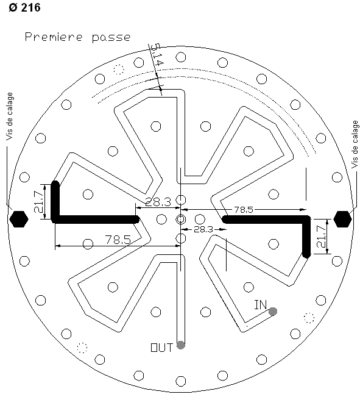

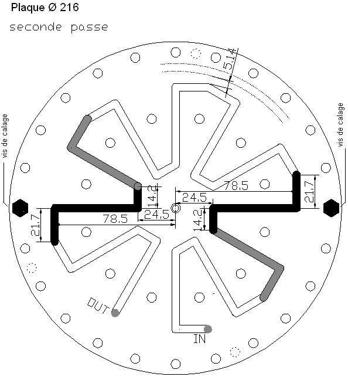

(les percements pour IN et OUT sont placés différemment que sur les photos)


NB L'entrée de vapeur n'est pas positionnée comme sur les photos

## SECTION III - FABRICATION DE LA PLAQUE CHAUFFANTE À VAPEUR

La section III "Fabrication de la plaque chauffante à vapeur" n'est qu'un regroupement des plans
déjà présentés dans la section "Etude" , afin de disposer d'un jeu de plans en atelier. Pour les détails, il faudra autant que besoin se reporter aux indications de la section "Etude"

Fabrication d'une plaque chauffante diam 240 mm, composée de 2 toles d'alu ep 9,52 ou 10 mm.

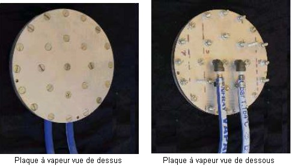

(les détails de fabrication ne correspondent pas aux plans ci dessous)

### III.1 APPROVISIONNEMENT, DEBIT ET MARQUAGE DES PLAQUES


Marquer les centres au foret à centrer sans traverser la plaque. Utiliser un foret dont l'angle est
compatible avec la pointe de la poupée mobile du tour (voir ci dessous).

**Repérer les plaques :** les plaques brutes ne sont généralement pas parfaitement planes. Il convient soit de les dresser (sur tour? Sur fraiseuse? À l'aide d'une presse?), soit de repérer soigneusement les déformations de façon à les contrarier et les annuler, cette dernière solution étant la plus simple. Noter que la profondeur de la gorge du joint torique devra être régulière, ce qui suppose une plaque plane.
Assembler les plaques pour le mieux, puis **marquer les plaques,** par exemple :
"Plaque supérieure- face de dessus" et "plaque supérieure- face de joint"
"Plaque inférieure – face de joint" et "Plaque inférieure- face de dessous"
Repérer aussi les plaques sur chant, pour bien les orienter, et reporter ces repères sur le plat, car les repères sur chant vont disparaître à la prochaine étape.

### III.2 USINAGE SUR TOUR

**A) REPRISE DES CHANTS**

**B) USINAGE DE LA GORGE DU JOINT TORIQUE**

usiner la gorge du joint torique sur la plaque supérieure - face de joint. Vérifier sur le tour
que la plaque n'est pas voilée, afin d'avoir une profondeur de gorge régulière.

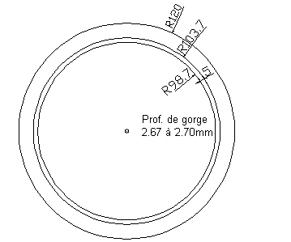

### III.3 PERCEMENTS ET TARAUDAGE DES PLAQUES

**A) PERCEMENTS POUR L'ASSEMBLAGE**

Les plaques sont assemblées par des vis inox M6 à tête fraisée.
Les têtes de vis sont apparentes sur la plaque supérieure – face de dessus
Les vis sont vissées dans la plaque inférieure, puis elles reçoivent un écrou.
Effectuer les perçages au Ø 6,1 mm pour le passage des vis dans la plaque supérieure, et au Ø 5 mm pour les taraudages.

**B) PERCEMENTS POUR TARAUDAGE DES RACCORDEMENTS DE VAPEUR**
Ces deux percements sont à effectuer uniquement sur la plaque inférieure.

**C) PERCEMENTS POUR PRE-ASSEMBLAGE DES PLAQUES**
Il est très utile de disposer de quelques percements et taraudages supplémentaires en périphérie,
disposés non symétriquement, pour éviter les erreurs et inversions en tous genres lors des travaux.


Dans un premier temps, effectuer **tous** les percements au Ø 5 mm **jusqu'à mi épaisseur** environ de la plaque supérieure, y compris les entrée-sortie de vapeur, afin de les repérer ultérieurement.
Pour des questions de lisibilité, les cotes des percements sont fournies sur deux feuilles de plans
différentes, mais tous ces percements Ø 5 mm s'effectuent sans avoir à dépointer les plaques de la fraiseuse.

Avec un peu de malchance, il peut être nécessaire de percer de part en part la plaque inférieure en son centre, afin de le repérer sur la fraiseuse. Ce n'est pas bien grave, il sera toujours possible plus tard de tarauder le percement et de le boucher avec une vis à tête fraisée.

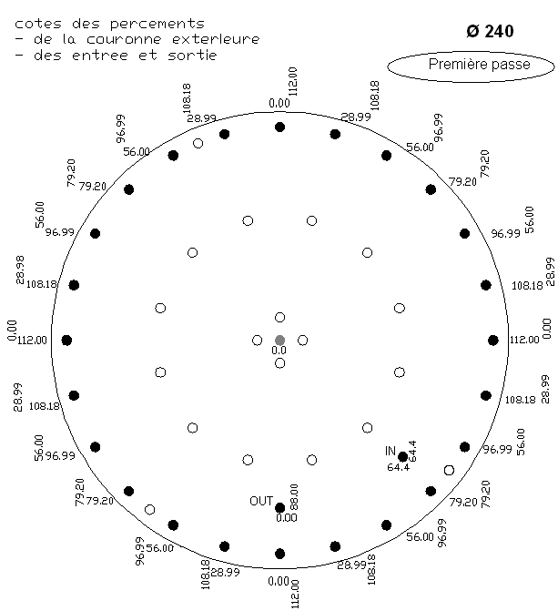

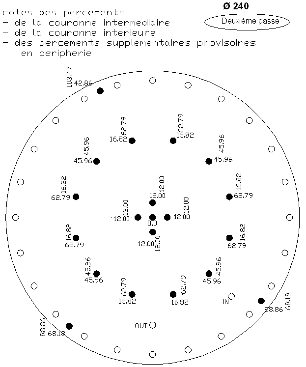

On peut ensuite reprendre chaque plaque :
**Plaque inférieure** : - tarauder les percements d'assemblage et de préassemblage

- repercer et tarauder les entrées-sortie de vapeur à 1/8"

**Plaque supérieure** : - reprendre tous les percements au foret Ø 6,1mm

- effectuer les fraisages pour les têtes de vis. Contrôler la conformité de l'angle
de la fraise avec l'angle des têtes de vis (normalisé à 90° pour les vis à pas métrique, et veiller à ce
que aucune tête de vis ne dépasse, le transfert thermique ne le supporterait pas un espace entre la
plaque et le récipient.(ce n'est pas bien grave si la tête est légèrement en retrait) Pour la même
raison, il peut être nécessaire d'ébavurer les fraisages avec une toile abrasive.

### III.4 LA GRAVURE DU CIRCUIT DE VAPEUR

Le circuit de vapeur est gravé sur la plaque supérieure- face de joint, c'est à dire sur la même gorge que le joint torique.
**Section du circuit** : largeur 5 mm, profondeur 3 mm
**Une fraise "end mill"** double flute Ø 5 mm convient, par exemple Mcmaster 8555A62.
**Installer la plaque** sur la table de la fraiseuse, insérer deux vis M6 dans les percements "extrême.
gauche" et "extrême droite". Caler les deux vis contre la rainure centrale de la table de la fraiseuse, et fixer la plaque sur la table. Insérer une pointe à centrer dans le mandrin de la fraiseuse, centrer la table par rapport au centre de la plaque, et mettre l'affichage digital à Zéro en X et en Y

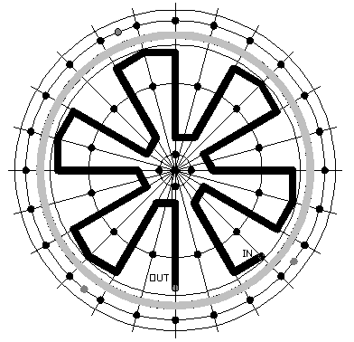

**Effectuer la première passe** : Graver les deux rayons parallèles à la table, et les deux
perpendiculaires

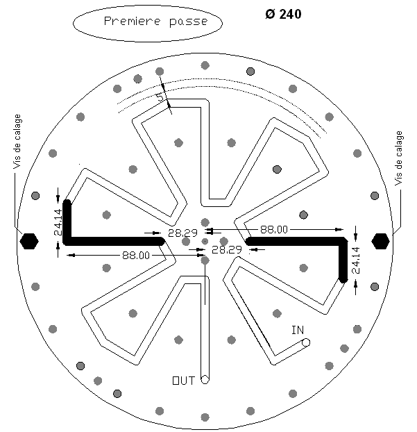

**Déposer/reposer la plaque** sur la table de la fraiseuse en la calant comme précédemment après
une rotation de 30°.
**Effectuer la seconde passe**.
**Noter** que la seconde passe et la première passe ne sont pas exactement identiques, voir notamment la cote 28,29 mm sur la première, et la cote 24,5 sur la seconde. Toutefois il n'y a pas d'inconvénient majeur si une engravure se prolonge quelque peu au delà du tracé prévu, sauf à l'approche du joint torique,

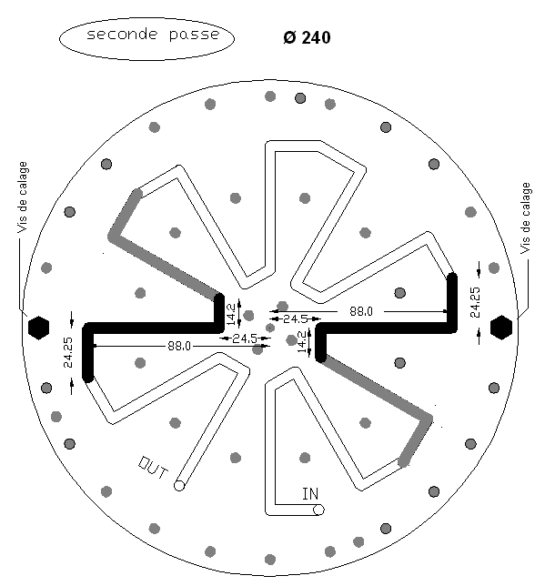

NB L'entrée de vapeur n'est pas positionnée comme sur les photos

### III.5 L'ASSEMBLAGE
Utiliser des vis à tête plate fraisée** M6 L = 25mm en acier inoxydable, sans rondelle (à
cause de l'étancheite).
**Utiliser un produit d'étancheité** du type "frein filet" résistant à la température (Loctite
272 ?). Garnir le filet, mais aussi la tête de vis, ainsi que l'écrou.
**Serrage dynamométrique** 8 à 9 Nm = 5,9 à 6,6 lbf.ft = 70 à 80 lbf.pour la vis, et ensute
pour l'écrou

## SECTION IV UTILISATION ET PERFORMANCES DE LA PLAQUE CHAUFFANTE À VAPEUR

### IV.1 UTILISATION DE LA PLAQUE CHAUFFANTE À VAPEUR

Toutes les informations concernant la régulation de la vapeur (1ère partie, Chapitre IV, Section VIII) et la conduite du capteur (1ère partie, Chapitre VI, Section II) concernent également la plaque chauffante à vapeur, le lecteur voudra bien s'y reporter

### IV.2 PERFORMANCES ET FONCTIONNEMENT DE LA PLAQUE À VAPEUR

La notion de performances de la plaque à vapeur n'est pas aussi simple que pour le dispositif de production de vapeur. Il s'agit ici de production, mais uniquement de transfert thermique, lequel dépend entre autres des paramètres suivants

- la surface de la plaque : toutes choses égales par ailleurs, une grande plaque transmet plus de chaleur qu'une petite plaque (était-il besoin de le dire? ). Donc une plaque d'une surface donnée a une limite haute qu'elle ne pourra dépasser.
- la qualité du transfert thermique entre la vapeur et la plaque. Ici, il est excellent
- la qualité du transfert thermique entre la plaque et le récipient ; l'huile est là pour l'améliorer.
- La qualité du transfert thermique à travers le fond du récipient de cuisson
- La qualité du transfert thermique dans le récipient. Elle est excellente si il y a un peu d'eau dans le fond du récipient, qui se vaporise, transfère la chaleur aux aliments, se condense, puis se vaporise à nouveau etc... : c'est la cuisson à la vapeur à pression atmosphérique. Par contre, si le récipient est rempli de pommes de terre sans une seule goutte d'eau, le transfert thermique interne est exécrable voire nul, la vapeur fournie par le capteur fuse à la sortie des robinets de régulation, et les pommes de terre ne seront jamais cuites (ni brûlées)
- Mais surtout, l'importance du transfert thermique est fonction de la différence de température entre le fluide thermique (la vapeur) et le contenu du récipient de cuisson. Plus cette différence est importante, et plus le transfert est intense. S'il n'y a plus de différence de température, il n'y a plus aucun transfert. Or cette différence de température varie tout au long de la mise en chauffe du récipient de cuisson. En début de cuisson, le Δ t est important, l'échange thermique aussi, puis cela va s'amenuisant au fur et à mesure de la mise en chauffe. Dans le cas d'une cuisson à l'eau, ce sont les quelques derniers degrés avant ébullition qui sont critiques. Au delà, il suffit d'un peu d'énergie (donc d'un peu de transfert) pour maintenir l'ébullition, c'est à dire pour compenser les pertes, lesquelles sont assez faibles puisque le récipient est dans un caisson isolant. Le conducteur du capteur profite de cette période de maintien à ébullition pour charger son bouilleur en eau fraiche à vaporiser, et être prêt pour la prochaine séance.

Autrement dit, une bonne plaque chauffante à vapeur est celle qui est capable de transférer au récipient toute l'énergie fournie par le capteur, y compris au moment où le contenu du récipient est sur le point de parvenir à son seuil maximum de température

**Le test de bon fonctionnement de la plaque chauffante à vapeur** est assez simple : si il n'y a pas de vapeur en sortie du système de régulation, cela signifie que toute la vapeur fournie est condensée, donc que le transfert thermique s'effectue correctement. La puissance de transfert de la plaque est alors assimilable à la puissance du capteur (voir "performances du capteur" dans la première partie de la documentation).

Si de la vapeur apparaît en sortie du système de régulation, la cause peut en être:

_a) Une mauvaise adéquation des composants_
Par exemple : plaque trop petite,

_b) une mauvaise utilisation des composants_
Par exemple : absence d'huile entre la plaque et le récipient, contenu du récipient insuffisant, absence d'eau dans le récipient, ou bien un Δ t insuffisant (on peut alors essayer de travailler à une pression supérieure, en manoeuvrant les robinets de régulation manuelle ou automatique) ou bien... l'eau est peut-être en train de bouillir?

Si la puissance du capteur augmente ;, il est évident qu'à un moment donné la plaque ne sera plus capable de transmettre toute l'énergie au récipient. Il sera peut-être temps de brancher une seconde plaque sur le capteur. Si l'échangeur était un tube de cuivre de quelques dizaines de centimètres immergé dans un grand récipient d'eau, il absorberait toute l'énergie fournie par un grand capteur :
les capacités d'échange thermique de la plaque et celles d'un tube cuivre immergé sont sans
commune mesure – mais l'ergonomie n'est pas la même. Tout est affaire d'adéquation entre les
différents composants. Pour un capteur de 2m², la plaque à vapeur est tout à fait adaptée.

## SECTION V UNE PLAQUE À VAPEUR LOW COST

Plusieurs plaques chauffantes à vapeur ont été construites avant de parvenir à la configuration décrite dans les sections précédentes. La toute première plaque à vapeur était même d'un type différent. Elle consistait en une plaque de cuisinière électrique de récupération, dans laquelle avait été inséré, à la place de la résistance électrique, un tube de cuivre. Elle fonctionnait fort bien, capable d'effectuer une cuisson dans un petit autocuiseur Lagostina (qui travaille à 1 bar/121° C). En fait les limites de cette plaque n'ont jamais été testées, et il serait un peu prématuré de l'envoyer aux oubliettes (comme l'ont été la plupart des essais de Soleil-Vapeur...)

Photos d'une plaque chauffante confectionnée à partir d'une plaque de cuisinière électrique.

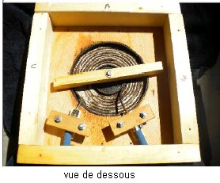

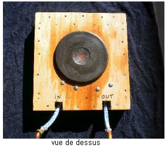

Voici quelques indications concernant sa fabrication

**- se procurer une plaque de cuisinière électrique** , le plus grand diamètre sera le mieux (la capacité de transfert thermique dépend, entre autres, de la surface disponible pour le transfert)
**- dégarnir la résistance électrique** et la pâte réfractaire qui l'entoure
**- modifier le parcours des résistances** dans la fonte de la plaque. Les plaques électriques sont prévues pour fonctionner en triphasé ou en monophasé, il y a donc trois parcours pour trois résistances. Il faut les rectifier quelque peu, afin de pouvoir loger un seul serpentin en un parcours unique. La modification s'effectue à la petite meuleuse à une main, éventuellement avec une petite meuleuse de bricolage type Dremel. Ne pas hésiter à tailler franchement dans la fonte pour laisser le passage au tube de cuivre, et nettoyer très proprement le fond de l'engravure pour faciliter me transfert thermique et la mise en œuvre de la soudure.
**- se procurer un tube de cuivre Ø 4,8 mm**. Ce type de tube est utilisé pour les circuits de freinage de camions, on peut se le procurer chez les revendeurs de pièces détachées automobiles ou camions.

**- Ovaliser légèrement le tube.** Le diamètre 4,8 mm est légèrement trop fort pour insérer le tube dans l'engravure. Il est nécessaire de l'ovaliser légèrement, sur toute sa longueur, en le pressant avec doigté dans un étau.
**- Insérer le tube dans l'engravure** en serpentin, au besoin avec quelques coups de marteau en interposant une cale de bois.
**- Afin d'assurer un meilleur transfert thermique** entre le tuyau et la plaque, répandre de la brasure tendre sur la "galette" en procédant ainsi

   - se procurer une bobine de brasure tendre à l'étain, si possible avec peu de plomb, et le décapant y afférent. La température de fusion est de l'ordre de 180° C
   - Mettre l'ensemble à chauffer dans un four. Un four de cuisinière convient très bien, régler le thermostat à 220° (?) environ.
   - Lorsque la galette est chaude, la sortir du four, répandre le décapant, et faire fondre la brasure en l'approchant du cuivre et de la fonte. Elle doit fondre instantanément, et se répandre toute seule, sinon reprendre la chauffe.

Nul ne s'engagera sur le coefficient général de transfert thermique de l'ensemble ainsi constitué, mais le fait est que, compte tenu des faibles flux thermiques en jeu, cet ensemble fonctionne. Sur ce principe, il n'est donc pas interdit d'imaginer des variantes en fonction des disponibilités locales.

Pour ce qui est des performances, tout ce qui a été dit dans la section précédente reste valable pour les plaques "low cost".


