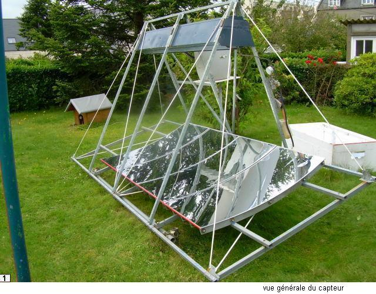
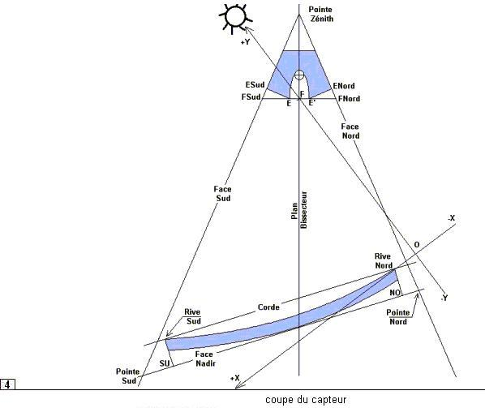
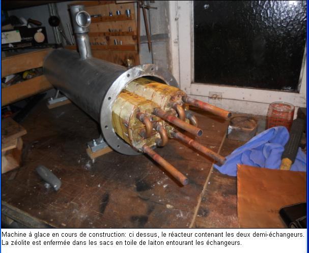
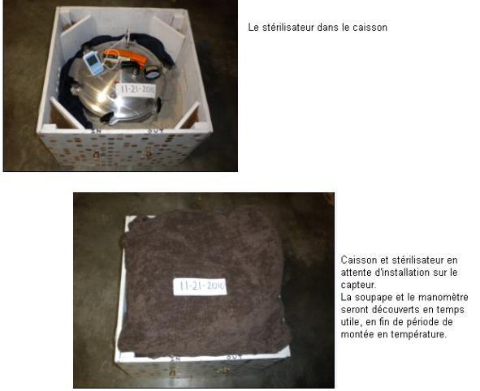
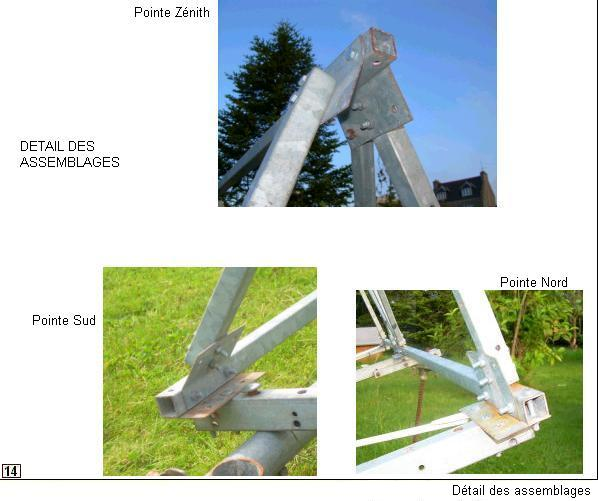
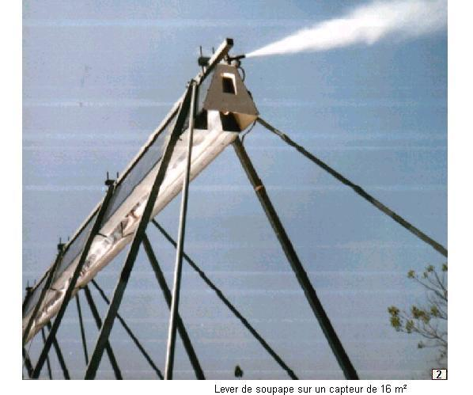

# Documentation de soleil-vapeur

**Cuisson alimentaire, Stérilisation médicale**  
**Production de glace par adsorption**  
**avec le groupe solaire thermique à vapeur "soleil-vapeur"**  
**100 à 164°C / 0 à 6 bar / 0.5 à 10 kW**

## Contexte et situation actuelle

Un travail de conception et d'expérimentation autour de systèmes solaires à concentration a été mené entre les années 1990 et 2017 par un petit groupe de chercheurs et d'ingénieurs indépendants en France et aux USA.
[Les résultats de ces travaux ont été soigneusement documentés entre 2012 et 2017](doc-asso.htm). Depuis le groupe de travail n'est plus actif et la documentation (et le site web) ne sont plus entretenus.

**Pour ne pas perdre cet énorme effort de cette riche documentation de près de 1000 pages**, [Emmanuel](https://emlaurent.github.io/ingenierie_en_sobriete/) a repris toute la documentation et remis à jour le site web. Cette documentation, accessible en bas de cette page (ou par les liens sur la gauche), mériterait d'être mise à jour (corrections de liens vers les fournisseurs, pagination, ...). Certaines parties n'ont pas été écrites et mériteraient un travail de documentation - après des temps d'expérimentation. [Une ancienne version du site](http://jean.boubour.pagesperso-orange.fr/) reste encore accessible.
 
Techniquement, **la documentation a été transférée sur un compte github** et la page initiale d'accueil a été conservée (voir le texte ci-dessous) avec seulement une remise en page et l'ajout de ce contexte. Les documents sont des fichiers PDF plus quelques pages au format html. A titre de test, [un fichier pdf a été transformé en fichier markdown](2-sommaires-et-pdf/2-Chap-I-Plaque.md) (en extrayant les images et le texte puis en effectuant une remise en page). L'idée est de tester l'utilisation de github pour faire du suivi des modifications et des mises à jours à plusieurs contributeurs.
Si vous êtes intéressés pour contribuer à mettre à jour cette documentation ou à gérer la mise à jour avec github, contactez [Emmanuel](https://emlaurent.github.io/ingenierie_en_sobriete/).

Certains documents sont sous licence Creative Commons mais un échange avec l'auteur des documents a permis de valider que sa volonté est de rendre accessible toute cette connaissance. **L'ensemble des éléments de ce site et tous les documents pdf téléchargeables sont donc sous licence Creative Commons CC-by-SA.** 

## Introduction au travail de conception
Le propos est de rassembler les connaissances scientifiques et 
technologiques relatives à la conception, la construction et 
l'utilisation d'une installation solaire thermique à moyenne température
destinée à la cuisson, à la stérilisation alimentaire et médicale et à 
la production de glace par adsorption, en utilisant comme fluide 
thermique de la vapeur d'eau à la température de 100 à 165° C, soit à 
une pression de 0 à 6 bar manométriques, dans une gamme de puissance 
disponible pour l'utilisateur de l'ordre de 0,5 à 10 kW, ou plus si 
besoin.

 

Cette installation solaire comprend:

* **Un dispositif de *production de vapeur* à l'aide d'un capteur solaire thermique à conduite manuelle**, composé de:
  * un miroir cylindro parabolique, orienté Est-Ouest 
  * un Concentrateur Parabolique Composé,
  * une chaudière, en l'occurence un tube installé en fond du Concentrateur,
  * une charpente tubulaire,
  * un dispositif manuel de pointage du capteur,.
* **Des  dispositifs *d'utilisation de la vapeur***, parmi lesquels
notamment une plaque de cuisson à vapeur**, au fonctionnement identique à 
celui d'une plaque de cuisson électrique, sur laquelle l'utilisateur 
pose son récipient de cuisson alimentaire ou de stérilisation médicale. 
D'autres dispositifs (serpentin immergé, serpentin extérieur au 
récipient de cuisson....) sont également décrits.

Cette installation solaire à concentration peut trouver une utilité 
dans les régions bénéficiant d'un bon ensoleillement direct ( à 
l'exclusion du rayonnement diffus) , et aux ressources énergétiques 
traditionnelles limitées. L'installation, de conception rustique, est à 
conduite entièrement manuelle, sans recours à aucun automatisme, ni 
asservissement, ni besoin d'un raccordement électrique.

On n'aborde donc pas ici le domaine de l'énergie solaire thermique à 
température inférieure à 100°C (eau chaude sanitaire, chauffage de l' 
habitat), ni le domaine de l'énergie thermique à haute température 
(centrales électro-solaires).On n'aborde pas non plus le domaine des 
cuiseurs-boites ou des cuiseurs-paraboles, largement décrits par 
ailleurs.

L'utilisation d'un fluide thermique, en l'ocurence la vapeur, permet de 
regrouper en un point d'utilisation un flux énergétique solaire réparti 
dans l'espace, et de disposer d'une puissance importante. Le capteur 
« soleil-vapeur » n'est pas destiné à un usage personnel ou 
familial, il est destiné à un usage professionnel ou collectif, là où 
l'énergie thermique est désormais de plus en plus comptée.

 

Il est un élément de solution pour l'approvisionnement en énergie 
thermique, comme source principale ou comme appoint, par exemple en 
restauration collective, ou pour les petites installations 
agro-alimentaires (abattoir, laiterie, conserveries, semouleries, 
brasseries...), savonnerie, distilleries en tous genres (parfums, huiles
 essentielles), production de bio diesel du type jatropha curca, etc 
....

L'utilisation-phare, à savoir la stérilisation médicale à la vapeur, 
justifie à elle seule l'utilité du capteur.Sur le sujet, on peut 
consulter l'article  ["Validation of the Efficacy of a Solar-Thermal 
Powered Autoclave System for Off-Grid Medical Instrument Wet 
Sterilization"](http://www.ajtmh.org/content/87/4/602.abstract) 
paru  dans The American Journal of Tropical Medicine and Hygiene.

Les cuissons à l'huile et les cuissons au four, qui nécessitent des 
températures plus élevées, ne sont pas pour le moment une priorité dans 
les travaux de soleil-vapeur,  mais l'expérience acquise permet d'ores 
et déjà de paramétrer un capteur apte à cuire du pain.

Les travaux concernant l'installation solaire se sont déroulés 
principalement dans le cadre associatif de soleil-vapeur.org qui 
regroupait initialement quelques bretons de la région de Brest en 
France. Il n'y avait au départ ni obligation ni planning, mais il y 
avait une obstination sans faille. Avec le recul du temps on se rend 
compte que les progrès ont été rythmés par les rencontres avec la (ou 
les) personne(s) compétente(s) au bon moment sur le problème du moment, 
et par les disponibilités en financement (privés pour l'essentiel). Il y
 a eu ainsi une succession de temps forts (premiers jets de vapeur en 
1995, brevet  pour le dispositif optique du capteur en 1996,......, 
plaque chauffante à vapeur en 2010 et  stérilisation médicale en 2011.à 
l'Université Rice de Houston ..) et de temps plus faibles. À ce jour, 
cette saga ne connait pas encore son point final, quelques chapîtres 
restent encore à écrire, particulièrement au sujet de la production de 
la glace.

------------

Une **machine de production de glace par adsoption** (avec zéolite), 
fonctionnant avec la vapeur produite par le capteur, a été 
spécifiquement conçue et réalisée. Au vu des résultats très 
encourageants qui ont été obtenus, une seconde machine à glace est 
actuellement (2013) en construction, selon les mêmes spécifications. La 
première machine, aux allures de prototype expérimental, ne fait pas 
l'objet d'une publication. Si la seconde machine  confirme les résultats
 de la première, on peut envisager une publication vers le début de 
2014.

 

------------

On présente ci dessous tous les éléments nécessaires pour construire 
une petite installation avec une surface de miroirs de 2m². En raison 
des effets d'échelle, redoutables dans le domaine de la thermique, c'est
 selon notre expérience la plus petite taille possible pour un capteur 
solaire utilisant un fluide thermique. Néanmoins sa puissance utile est 
de l'ordre de celle d'un brûleur à gaz ou d'une plaque électrique de 
taille moyenne sur une cuisinière, pendant six heures par jour. Elle est
 suffisante pour effectuer trois cuissons de 4 kg de légumes par jour (à
 l'eau, à la vapeur, ou braisés). 

Sa puissance permet surtout de faire fonctionner un stérilisateur 
médical à vapeur par exemple du type All American 1915X  ou 1925X, d'une
 capacité brute de 14 et 25 litres.

 

Mais hormis la stérilisation médicale, le petit capteur de 2 m² a une
 vocation essentiellement pédagogique. En raison de l'absence de culture
 en matière de vapeur, et des contraintes inhabituelles imposées par 
l'énergie solaire, l'implantation d'une installation solaire thermique 
relève quelque peu du parcours initiatique. Sauf à être dans des 
conditions particulièrement favorables, il n'est pas conseillé de 
commencer par un capteur de grande taille de 12 ou 20 m². Il est 
préférable de commencer par un petit capteur de 2 m², pour laisser 
l'énergie solaire et ses utilisateurs s'acclimater l'un à l'autre. Le 
petit capteur est un bon point de départ avant d'envisager des machines 
plus importantes (et plus rentables sur un plan énergétique en raison de
 l'effet d'échelle). Dans le petit capteur on retrouve tant pour le 
constructeur que pour l'utilisateur tous les ingrédients d'une machine 
plus importante, mais à taille humaine.L'intérêt du système proposé est 
d'être ultérieurement sans limite de taille (on peut juxtaposer des 
capteurs de 10 kW), mais il est indispensable de commencer petit. Que 
penser d'un constructeur amateur débutant qui commencerait par 
construire un voilier de quinze mètres sans même avoir au préalable fait
 ses premières armes sur une petite barcasse pour bord de plage ?
S'il n'y a pas, à tous les niveaux (constructeur, utilisateur...), 
d'appropriation d'un petit capteur de 2 m², il ne faut pas rêver d'un 
capteur plus grand, mais au moins l'échec aura été limité, et le petit 
capteur trouvera ailleurs une utilisation  en stérilisation médicale.

------------------

Pour construire un capteur tel que celui proposé ici, le niveau de 
technicité requis est celui de l' « amateur soigneux », 
le terme amateur étant pris au sens de « qui aime bien », et 
non pas au sens de « dilettante ». Tracer, couper et percer 
des tubes avec précision ne requiert pas une technicité hors du commun.

On peut comparer la construction d'un capteur avec la construction 
d'une charrette à cheval dans les campagnes européennes au 19ème siècle:
 certains composants provenaient d'usine, par exemple l'essieu venu de 
forge avec ses deux fusées tournées côniques, les moyeux des roues, 
l'approvisionnement en produits semi finis, barres de fer, etc... La 
construction  de la charrette proprement dite, des roues et du 
harnachement sont effectués sur place par le charron, le forgeron, le 
bourrelier. Ainsi pour le capteur, certains composants proviennent 
d'usine: les profils paraboliques, l'approvisionnement en tubes et 
tôles, la confection du bouilleur.., mais la construction du capteur lui
 même est à faire au plus près possible de ses utilisateurs.

 

Un premier mot d'ordre: de la rigueur. La force (mais aussi la 
faiblesse) du solaire, c'est que « ça marche toujours un 
peu ». Il ne faut pas se contenter du « un peu », il faut
 viser plus haut. 

Un deuxième mot d'ordre: n'effectuez aucune modification.
De nombreux paramètres entrent en ligne de compte dans le dessin du 
capteur, et l'on ne prétend pas ici avoir  parfaitement pénêtré et 
décrit leur fragile équilibre. Aussi, dans un premier temps, il convient
 pour le constructeur de respecter à la lettre toutes les indications 
fournies.

Le capteur tel que proposé ci dessous mérite de nombreuses 
améliorations.
Mais pour le capteur comme pour un avion, comme pour un voilier, il y a 
une multitude de paramètres que le débutant ne peut pas maitriser 
d'emblée tous ensemble. Il suffit d'en négliger un  pour que centre de 
gravité de l'avion, ou le centre de dérive du voilier, soient déplacés 
au point de les rendre ingouvernables et il est probable que personne ne
 trouvera jamais l'explication de l'erreur.

Voici les conseils donnés à des constructeurs amateurs d'un petit avion 
de tourisme (pouguide.org): "...Copiez exactement, sans rien changer. 
N'en faites pas à votre tête. Réservez à plus tard vos innovations, 
après que vous aurez 10 heures de vol. A ce moment, vous jugerez vos 
inventions sous un angle très différent..."   Ou bien encore: 
« ..Ne pas chercher à innover, profiter de l'expérience acquise par
 des prédécesseurs expérimentés. On verra pour le prochain. Ainsi vous 
éviterez des échecs si fréquents dans ce genre d'entreprise ».

-------------------------

Pour aborder en douceur la fabrication d'un capteur, il est possible 
également d'utiliser la malle pédagogique, qui fournit toutes les 
indications pour construire une maquette (non opérationnelle) du 
capteur, pour  construire un échantillon en grandeur nature du miroir, 
et pour construire un échantillon en grandeur nature du Concentrateur 
Parabolique Composé (1- Chap VII).

-------------------

Avant d'entrer dans le vif du sujet, livrons nous à un petit calcul,
dont chacun tirera les conclusions qu'il voudra.

Soit une surface boisée de un hectare en zone tempérée, exploitée 
correctement. Elle produit entre 2200 et 3600 kg de bois sec par an, 
dont le pouvoir calorifique est de 15 à 16 MegaJoule par kg. On récupère
 donc chaque année au moins 2 200 * 15 = 33 000 MJ, et au plus 3 600 * 
16 = 57 600 MJ.sur un hectare. On retient ici le chiffre de  4 MJ 
d'énergie-bois par an et par mètre carré de surface boisée. Une fois 
introduits dans une chaudière avec un rendement de 0,6 on obtient
**2,4 MegaJoule de vapeur par m² et par an.**
S'agissant d'une surface boisée en zone tempérée, on considère qu'elle 
reçoit un flux solaire annuel de l'ordre de 5 000 MJ par mètre carré et 
par an. .

Le rendement en bois / énergie solaire est donc de l'ordre de  4 / 5 000 = 0,08 %, et le rendement en vapeur de l'ordre de 0,05%

Soit par ailleurs un capteur du type « soleil-vapeur »,
fonctionnant pendant  1000 heures par an sous un flux solaire de 900 
Watt par m²,avec un rendement de 0.5. Pour Un mètre carré de capteur, on
 obtient 1000 heures* 900 Watt * 3600 secondes * 0,5  = <
 **1 620 MegaJoule de vapeur par m² et par an.**
( Le Joule est l'unité d'énergie mécanique, thermique, électrique...
1 Watt = 1 Joule/seconde; 1 MegaJoule = 1 000 000 J)

Le rapport entre « l 'énergie vapeur » disponible avec 1 m² 
de surface boisée, et « l'énergie vapeur » disponible avec 1 
m² de capteur solaire, est de 2.4/1620, soit 1/675.
Sans ergoter sur les détails du raisonnement (on ne tient pas compte du
 travail du bucheron, ni de la construction de capteur, etc... etc...), 
on retient ici comme une image qu'il y  a "deux zéros avant la virgule 
décimale" de différence entre la forêt et le capteur. On entrevoit aussi
 le rendement utilisable de la biomasse par rapport au flux solaire, qui
 oscille entre le dix millième et le millième. En reprenant le calcul 
avec l'huile de Jatropha  Curcas, les  ordres de grandeur restent 
désespérément les mêmes (800 à 1800 litres par hectare, à 37 
MegaJoule/kg ?). En poursuivant les calculs avec l'huile de tournesol, 
il n'y a aucune amélioration (1 200 Kg, à 38 MegaJoule/kg ?).

Pourtant depuis la conquête du feu, il est beaucoup plus facile de 
cuire ses aliments avec du bois, du charbon ou du gaz qu'avec un capteur
 solaire, mais c'est bien parce que la nature a patiemment et 
préalablement capté, transformé, concentré et mis en conserve 
gratuitement l'énergie solaire. Sauf tout le respect dû aux bucherons et
 aux mineurs de fond, l'homme n'a plus qu'à se servir, comme on 
viendrait se servir gratuitement dans une grande armoire à confitures, 
laissant le sol jonché de pots cassés et à demi-entamés  (on commence 
même à entrevoir le fond de l'armoire ).
Quand c'est à l'homme de capter et concentrer le rayonnement solaire, 
de fabriquer lui même la confiture, on commence alors à  entrevoir le 
vrai coût technologique et économique de l'énergie.

 

-------------------

## Documentation
La documentation est divisée en parties et en chapitres. La 
pagination est spécifique à chaque chapître. Une table des matières 
détaillée figure en tête de chaque chapître. 
Tous les documents  pdf sont datés en pied de page.
Le sommaire à gauche de l'écran tient également lieu de plan du site.
* Partie 1 Le capteur solaire et la production de vapeur
* Partie 2 Cuisson alimentaire et stérilisation médicale
* Partie 3 Production de glace par adsoption
* Partie 4 Mémento technologique
* Partie 5 Vers d'autres horizons
* Partie 6 Cuiseur "Fresnel" à conduite manuelle 

[**Toutes les documentations en un seul fichier**](documentation-totale.pdf) 

### 1ère partie: le capteur et la production de vapeur

* <a href="1-sommaires-et-pdf/1-I-dossier-calculs.pdf">1-Chap.I- Dossier de calculs </a> 
* <a href="1-sommaires-et-pdf/1-II-conception.pdf">1-Chap.II- Conception du capteur </a> 
* <a href="1-sommaires-et-pdf/1-III-etude-capteur.pdf">1-Chap.III- Etude du capteur </a> 
* <a href="1-sommaires-et-pdf/1-IV-Etude-Circuit.pdf">1-Chap.IV- Etude du circuit de production de vapeur </a> 
* <a href="1-sommaires-et-pdf/1-V-Construction.pdf">1-Chap.V- Construction du capteur </a> 
* <a href="1-sommaires-et-pdf/1-VI-Installation-etc.pdf">1-Chap.VI- Installation, Conduite, Performances, Maintenance </a> 
* <a href="1-sommaires-et-pdf/1-VII-Malle-Pedagogique.pdf">1-Chap.VII- La Malle Pedagogique </a> 
* <a href="1-sommaires-et-pdf/1-VIII-Plans-Informatiques.html">1-Chap.VIII- Plans Informatiques </a> 
* <a href="1-sommaires-et-pdf/1-IX-ombre-portee.pdf">1-Chap.IX- Ombre portée d'un baton </a> 
* <a href="1-sommaires-et-pdf/1-X-positions-capteur.pdf">1-Chap.X- Positions du capteur </a> 

### 2ème partie: Utilisation de la vapeur 

* 2-Chap.I- La plaque chauffante à vapeur 
  * <a href="2-sommaires-et-pdf/2-Chap-I-Plaque.md">version PDF</a>
  * [Version markdown](2-sommaires-et-pdf/2-Chap-I-Plaque.md) visible en ligne
* <a href="2-sommaires-et-pdf/2-Chap-II-Caisson.pdf">2-Chap.II- Le Caisson isolant </a>
* <a href="2-sommaires-et-pdf/2-Chap-III-Sterilisation.pdf">2-Chap.III- La Stérilisation Médicale </a> 
* <a href="2-sommaires-et-pdf/2-Chap-IV-Cuisson.pdf">2-Chap.IV- La Cuisson Alimentaire </a>
* <a href="2-sommaires-et-pdf/2-Chap-V-Performances-etc.pdf">2-Chap.V- Performances et autres concepts </a>
* <a href="2-sommaires-et-pdf/2-VI-VIII-Autres-Utilisations.html">2-Chap.VI-VIII Autres Utilisations et Procedes</a>

### 3ème partie: Production de glace par adsorption 

* <a href="3-sommaires-et-pdf/3-I-presentation-machine.pdf">3-Chap.I- Présentation générale de la machine à glace </a> 
* <a href="3-sommaires-et-pdf/3-II-documentation-disponible.pdf">3-Chap.II- La Documentation disponible </a> 
* <a href="3-sommaires-et-pdf/3-III-etude-machine.pdf">3-Chap.I- Etude de la machine à glace </a> 
* <a href="3-sommaires-et-pdf/3-IV-construction-machine.html">3-Chap.IV- La Construction de la machine à glace </a>
* 3-Chap.V- Fonctionnement et Performances
* 3-Chap.VI- Choix fondamentaux et discussion
* 3-Chap.VII- Documentation technique et Fournisseurs

### 4ème partie: Memento technologique

* <a href="4-sommaires-et-pdf/4-Intro-Memento.html">Introduction au memento</a>
* <a href="4-sommaires-et-pdf/4-I-Vapeur-et-pertes.pdf">4-Chap.I- La Vapeur</a> 
* <a href="4-sommaires-et-pdf/4-II-Unites-anglo-saxonnes.pdf">4-Chap.II- Unites anglo saxonnes</a> 
* <a href="4-sommaires-et-pdf/4-III-Tubes-Toles-etc.pdf">4-Chap.III- Tubes, Toles, etc</a> 
* <a href="4-sommaires-et-pdf/4-IV-Boulons.pdf">4-Chap.IV- Boulons, Vis, Rivets</a> 
* <a href="4-sommaires-et-pdf/4-V-Plomberie.pdf">4-Chap.V- Plomberie et Filetages</a> 
* <a href="4-sommaires-et-pdf/4-VI-Brasage.pdf">4-Chap.VI- Le Brasage</a> 

### 5ème partie: vers d'autres horizons

* <a href="5-sommaires-et-pdf/Horizons.html"> Vers d'autres horizons</a> 
* <a href="5-sommaires-et-pdf/bibliographie.pdf"> Bibliographie</a> 
* <a href="5-sommaires-et-pdf/Carnot.pdf"> Le rendement de Carnot</a> 
* <a href="5-sommaires-et-pdf/anthropologie.pdf"> Cuisson et Anthropologie</a> 
* <a href="5-sommaires-et-pdf/cuisson%20solaire%20-%20quelques%20aspects%20techniques.pdf"> Cuisson solaire : quelques aspects techniques</a> 
* <a href="5-sommaires-et-pdf/effet%20echelle%20et%20ses%20ravages.pdf"> L'effet d'echelle et ses ravages</a> 
* <a href="5-sommaires-et-pdf/cuisson%20solaire%20-%20quelques%20aspects%20thermiques.pdf"> Cuisson solaire : quelques aspects thermiques</a> 
* <a href="5-sommaires-et-pdf/cuisson%20solaire%20-%20quelques%20aspects%20humains.pdf"> Cuisson solaire : quelques aspects humains</a> 
* Petit panorama partiel des cuiseurs solaires
* <a href="5-sommaires-et-pdf/caloducs.pdf">Cuiseur solaire à caloducs étagés</a> 
* <a href="5-sommaires-et-pdf/proposition%20de%20chauffage%20solaire%20a%20caloducs%20pour%20hautes%20latitudes.pdf"> Proposition : Chauffage à caloducs pour les hautes latitudes</a> 
* <a href="5-sommaires-et-pdf/proposition%20machine%20a%20glace-gaz%20echappement.pdf"> Proposition : Machine à glace et gaz d'échappement</a> 
* <a href="5-sommaires-et-pdf/pommes%20de%20terre%20et%20refrigeration.pdf"> Proposition : Pommes de terre et réfrigération</a> 
* Cuiseur photovoltaïque 
* Dessin d'un CPC pour capteur symétrique 
* Un capteur symétrique avec CPC: le Culbuto 
* épilogue 

### 6ème partie: Cuiseur "Fresnel" à conduite manuelle 

* [6-Chap.I-Vue d'ensemble](6-sommaires-et-pdf/Chap-I-Vue-d-ensemble.pdf)
* **Conception et Etude du cuiseur**
  * [6-Chap.II-Le suivi du soleil par un capteur Fresnel](6-sommaires-et-pdf/Chap-II-Le-suivi-du-soleil-par-un-capteur-Fresnel.pdf)
  * [6-Chap.III-Les miroirs sous tous leurs angles](6-sommaires-et-pdf/Chap-III-Les-miroirs-sous-tous-leurs-angles.pdf)
  * [6-Chap.IV-Détermination du rayon de courbure des miroirs](6-sommaires-et-pdf/Chap-IV-Determination-du-rayon-de-courbure-des-miroirs.pdf)
  * [6-Chap.V-Le CPC du second etage et le couplage des deux etages](6-sommaires-et-pdf/Chap-V-Le-CPC-du-second-etage-et-le-couplage-des-deux-etages.pdf)
  * [6-Chap.VII Etude des poutres du premier étage](6-sommaires-et-pdf/Chap-VII-Etude-des-poutres-du-premier-etage.pdf)
  * [6-Chap.VIII- Etude des miroirs du premier etage](6-sommaires-et-pdf/Chap-VIII-Etude-des-miroirs-du-premier-etage.pdf)
  * 6-Chap.IX-Leviers de manoeuvre et boitiers de réglage
  * 6-Chap.X-Commentaires
  * 6-Chap.XI-Récapitulation des éléments théoriques et des cotes de construction

* **Construction du cuiseur**
  * 6-Chap.X-Les poutres
  * 6-Chap.XI-Les miroirs du Ier étage
  * 6-Chap.XII-Le CPC
  * 6-Chap.XIII-La charpente du cuiseur
  * 6-Chap.XIV-Dispositif manuel de suivi du soleil
  * 6-Chap.XV-Le circuit de vapeur
  * 6-Chap.XVI-Installation du cuiseur
  * 6-Chap.XVI-Conduite du cuiseur

